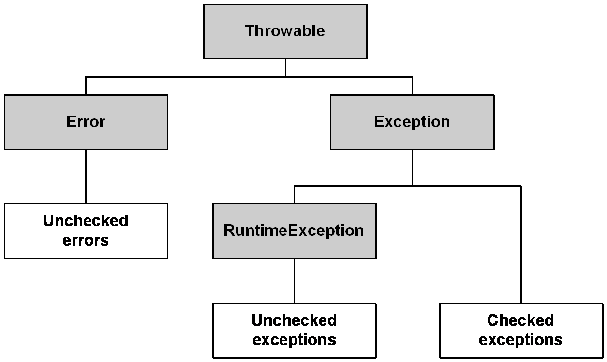

# exceptions-in-java



```bash
git submodule add https://github.com/openjdk/jdk6
git submodule add https://github.com/openjdk/jdk7
git submodule add https://github.com/openjdk/jdk8
git submodule add https://github.com/openjdk/jdk9
git submodule add https://github.com/openjdk/jdk10
git submodule add https://github.com/openjdk/jdk11
git submodule add https://github.com/openjdk/jdk12
git submodule add https://github.com/openjdk/jdk13
git submodule add https://github.com/openjdk/jdk14
git submodule add https://github.com/openjdk/jdk15
git submodule add https://github.com/openjdk/jdk16

git submodule add https://github.com/openjdk/jdk17
git submodule add https://github.com/openjdk/jdk18
git submodule add https://github.com/openjdk/jdk19
git submodule add https://github.com/openjdk/jdk20
git submodule add https://github.com/openjdk/jdk21
git submodule add https://github.com/openjdk/jdk22

git submodule update --init --recursive
git submodule update --remote

./mvnw clean compile exec:java -Dexec.mainClass="info.jab.jdk.ExceptionCounterExample" -Dexec.args="--enable-preview"

./mvnw prettier:write
```