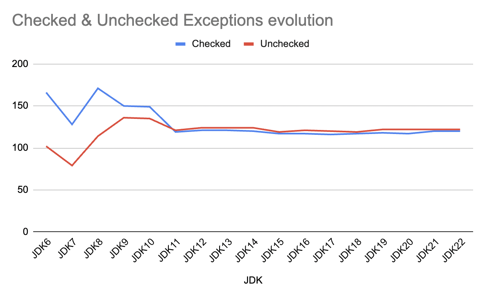

# Exceptions in Java

**Checked Exceptions:**
Checked exceptions are exceptions that are checked at compile-time. The Java compiler requires methods that can throw checked exceptions to either handle them within a try-catch block or declare them using the throws keyword in the method signature. This ensures that the programmer is aware of potential issues and has made provisions to handle them. Common examples of checked exceptions include IOException, SQLException, and ClassNotFoundException.

**Unchecked Exceptions:**
Unchecked exceptions, also known as runtime exceptions, are exceptions that are not checked at compile-time but rather at runtime. These exceptions extend the RuntimeException class. The Java compiler does not require methods to explicitly handle or declare unchecked exceptions. They typically indicate programming errors such as logic mistakes or improper use of an API. Examples include NullPointerException, ArrayIndexOutOfBoundsException, and IllegalArgumentException.


Source: https://web.deu.edu.tr/doc/oreily/java/langref/ch09_04.htm 

## How to build in local?

```bash
git submodule update --init --recursive

sdk env install
./mvnw clean compile exec:java -Dexec.mainClass="info.jab.jdk.ExceptionCounterExample" -Dexec.args="--enable-preview"

./mvnw prettier:write
```

## Exception inventory in Java 22

### Checked exceptions

- https://github.com/openjdk/jdk22/tree/master/src/java.base/share/classes/java/io/IOException.java
- https://github.com/openjdk/jdk22/tree/master/src/java.base/share/classes/java/lang/CloneNotSupportedException.java
- https://github.com/openjdk/jdk22/tree/master/src/java.base/share/classes/java/lang/InterruptedException.java
- https://github.com/openjdk/jdk22/tree/master/src/java.base/share/classes/java/lang/ReflectiveOperationException.java
- https://github.com/openjdk/jdk22/tree/master/src/java.base/share/classes/java/lang/RuntimeException.java
- https://github.com/openjdk/jdk22/tree/master/src/java.base/share/classes/java/lang/invoke/LambdaConversionException.java
- https://github.com/openjdk/jdk22/tree/master/src/java.base/share/classes/java/lang/invoke/StringConcatException.java
- https://github.com/openjdk/jdk22/tree/master/src/java.base/share/classes/java/net/URISyntaxException.java
- https://github.com/openjdk/jdk22/tree/master/src/java.base/share/classes/java/security/GeneralSecurityException.java
- https://github.com/openjdk/jdk22/tree/master/src/java.base/share/classes/java/security/PrivilegedActionException.java
- https://github.com/openjdk/jdk22/tree/master/src/java.base/share/classes/java/text/ParseException.java
- https://github.com/openjdk/jdk22/tree/master/src/java.base/share/classes/java/util/TooManyListenersException.java
- https://github.com/openjdk/jdk22/tree/master/src/java.base/share/classes/java/util/concurrent/BrokenBarrierException.java
- https://github.com/openjdk/jdk22/tree/master/src/java.base/share/classes/java/util/concurrent/ExecutionException.java
- https://github.com/openjdk/jdk22/tree/master/src/java.base/share/classes/java/util/concurrent/TimeoutException.java
- https://github.com/openjdk/jdk22/tree/master/src/java.base/share/classes/java/util/zip/DataFormatException.java
- https://github.com/openjdk/jdk22/tree/master/src/java.base/share/classes/javax/security/auth/DestroyFailedException.java
- https://github.com/openjdk/jdk22/tree/master/src/java.base/share/classes/javax/security/auth/RefreshFailedException.java
- https://github.com/openjdk/jdk22/tree/master/src/java.base/share/classes/javax/security/auth/callback/UnsupportedCallbackException.java
- https://github.com/openjdk/jdk22/tree/master/src/java.base/share/classes/javax/security/cert/CertificateException.java
- https://github.com/openjdk/jdk22/tree/master/src/java.base/share/classes/jdk/internal/org/objectweb/asm/tree/analysis/AnalyzerException.java
- https://github.com/openjdk/jdk22/tree/master/src/java.base/share/classes/jdk/internal/org/xml/sax/SAXException.java
- https://github.com/openjdk/jdk22/tree/master/src/java.base/share/classes/jdk/internal/util/xml/XMLStreamException.java
- https://github.com/openjdk/jdk22/tree/master/src/java.base/share/classes/jdk/internal/vm/TranslatedException.java
- https://github.com/openjdk/jdk22/tree/master/src/java.base/share/classes/sun/net/ftp/FtpProtocolException.java
- https://github.com/openjdk/jdk22/tree/master/src/java.base/share/classes/sun/util/locale/LocaleSyntaxException.java
- https://github.com/openjdk/jdk22/tree/master/src/java.base/unix/classes/sun/nio/fs/UnixException.java
- https://github.com/openjdk/jdk22/tree/master/src/java.base/windows/classes/sun/nio/fs/WindowsException.java
- https://github.com/openjdk/jdk22/tree/master/src/java.datatransfer/share/classes/java/awt/datatransfer/MimeTypeParseException.java
- https://github.com/openjdk/jdk22/tree/master/src/java.datatransfer/share/classes/java/awt/datatransfer/UnsupportedFlavorException.java
- https://github.com/openjdk/jdk22/tree/master/src/java.desktop/share/classes/java/awt/AWTException.java
- https://github.com/openjdk/jdk22/tree/master/src/java.desktop/share/classes/java/awt/FontFormatException.java
- https://github.com/openjdk/jdk22/tree/master/src/java.desktop/share/classes/java/awt/print/PrinterException.java
- https://github.com/openjdk/jdk22/tree/master/src/java.desktop/share/classes/java/beans/IntrospectionException.java
- https://github.com/openjdk/jdk22/tree/master/src/java.desktop/share/classes/java/beans/PropertyVetoException.java
- https://github.com/openjdk/jdk22/tree/master/src/java.desktop/share/classes/javax/print/PrintException.java
- https://github.com/openjdk/jdk22/tree/master/src/java.desktop/share/classes/javax/sound/midi/InvalidMidiDataException.java
- https://github.com/openjdk/jdk22/tree/master/src/java.desktop/share/classes/javax/sound/midi/MidiUnavailableException.java
- https://github.com/openjdk/jdk22/tree/master/src/java.desktop/share/classes/javax/sound/sampled/LineUnavailableException.java
- https://github.com/openjdk/jdk22/tree/master/src/java.desktop/share/classes/javax/sound/sampled/UnsupportedAudioFileException.java
- https://github.com/openjdk/jdk22/tree/master/src/java.desktop/share/classes/javax/swing/UnsupportedLookAndFeelException.java
- https://github.com/openjdk/jdk22/tree/master/src/java.desktop/share/classes/javax/swing/text/BadLocationException.java
- https://github.com/openjdk/jdk22/tree/master/src/java.desktop/share/classes/javax/swing/tree/ExpandVetoException.java
- https://github.com/openjdk/jdk22/tree/master/src/java.desktop/share/classes/sun/awt/image/ImageAccessException.java
- https://github.com/openjdk/jdk22/tree/master/src/java.desktop/share/classes/sun/awt/image/ImageFormatException.java
- https://github.com/openjdk/jdk22/tree/master/src/java.desktop/share/classes/sun/font/FontScalerException.java
- https://github.com/openjdk/jdk22/tree/master/src/java.instrument/share/classes/java/lang/instrument/IllegalClassFormatException.java
- https://github.com/openjdk/jdk22/tree/master/src/java.instrument/share/classes/java/lang/instrument/UnmodifiableClassException.java
- https://github.com/openjdk/jdk22/tree/master/src/java.management/share/classes/javax/management/BadAttributeValueExpException.java
- https://github.com/openjdk/jdk22/tree/master/src/java.management/share/classes/javax/management/BadBinaryOpValueExpException.java
- https://github.com/openjdk/jdk22/tree/master/src/java.management/share/classes/javax/management/BadStringOperationException.java
- https://github.com/openjdk/jdk22/tree/master/src/java.management/share/classes/javax/management/InvalidApplicationException.java
- https://github.com/openjdk/jdk22/tree/master/src/java.management/share/classes/javax/management/modelmbean/InvalidTargetObjectTypeException.java
- https://github.com/openjdk/jdk22/tree/master/src/java.naming/share/classes/javax/naming/NamingException.java
- https://github.com/openjdk/jdk22/tree/master/src/java.prefs/share/classes/java/util/prefs/BackingStoreException.java
- https://github.com/openjdk/jdk22/tree/master/src/java.prefs/share/classes/java/util/prefs/InvalidPreferencesFormatException.java
- https://github.com/openjdk/jdk22/tree/master/src/java.scripting/share/classes/javax/script/ScriptException.java
- https://github.com/openjdk/jdk22/tree/master/src/java.security.jgss/share/classes/org/ietf/jgss/GSSException.java
- https://github.com/openjdk/jdk22/tree/master/src/java.security.jgss/share/classes/sun/security/krb5/KrbException.java
- https://github.com/openjdk/jdk22/tree/master/src/java.smartcardio/share/classes/javax/smartcardio/CardException.java
- https://github.com/openjdk/jdk22/tree/master/src/java.smartcardio/share/classes/sun/security/smartcardio/PCSCException.java
- https://github.com/openjdk/jdk22/tree/master/src/java.transaction.xa/share/classes/javax/transaction/xa/XAException.java
- https://github.com/openjdk/jdk22/tree/master/src/java.xml.crypto/share/classes/com/sun/org/apache/xml/internal/security/exceptions/XMLSecurityException.java
- https://github.com/openjdk/jdk22/tree/master/src/java.xml.crypto/share/classes/javax/xml/crypto/KeySelectorException.java
- https://github.com/openjdk/jdk22/tree/master/src/java.xml.crypto/share/classes/javax/xml/crypto/MarshalException.java
- https://github.com/openjdk/jdk22/tree/master/src/java.xml.crypto/share/classes/javax/xml/crypto/URIReferenceException.java
- https://github.com/openjdk/jdk22/tree/master/src/java.xml.crypto/share/classes/javax/xml/crypto/dsig/TransformException.java
- https://github.com/openjdk/jdk22/tree/master/src/java.xml.crypto/share/classes/javax/xml/crypto/dsig/XMLSignatureException.java
- https://github.com/openjdk/jdk22/tree/master/src/java.xml/share/classes/com/sun/org/apache/bcel/internal/generic/TargetLostException.java
- https://github.com/openjdk/jdk22/tree/master/src/java.xml/share/classes/com/sun/org/apache/xalan/internal/xsltc/compiler/CompilerException.java
- https://github.com/openjdk/jdk22/tree/master/src/java.xml/share/classes/com/sun/org/apache/xalan/internal/xsltc/compiler/IllegalCharException.java
- https://github.com/openjdk/jdk22/tree/master/src/java.xml/share/classes/com/sun/org/apache/xerces/internal/impl/dv/DatatypeException.java
- https://github.com/openjdk/jdk22/tree/master/src/java.xml/share/classes/com/sun/org/apache/xerces/internal/impl/xpath/XPathException.java
- https://github.com/openjdk/jdk22/tree/master/src/java.xml/share/classes/com/sun/org/apache/xerces/internal/impl/xs/XMLSchemaException.java
- https://github.com/openjdk/jdk22/tree/master/src/java.xml/share/classes/com/sun/org/apache/xpath/internal/functions/WrongNumberArgsException.java
- https://github.com/openjdk/jdk22/tree/master/src/java.xml/share/classes/javax/xml/datatype/DatatypeConfigurationException.java
- https://github.com/openjdk/jdk22/tree/master/src/java.xml/share/classes/javax/xml/parsers/ParserConfigurationException.java
- https://github.com/openjdk/jdk22/tree/master/src/java.xml/share/classes/javax/xml/stream/XMLStreamException.java
- https://github.com/openjdk/jdk22/tree/master/src/java.xml/share/classes/javax/xml/transform/TransformerException.java
- https://github.com/openjdk/jdk22/tree/master/src/java.xml/share/classes/javax/xml/xpath/XPathException.java
- https://github.com/openjdk/jdk22/tree/master/src/java.xml/share/classes/org/xml/sax/SAXException.java
- https://github.com/openjdk/jdk22/tree/master/src/jdk.attach/share/classes/com/sun/tools/attach/AgentInitializationException.java
- https://github.com/openjdk/jdk22/tree/master/src/jdk.attach/share/classes/com/sun/tools/attach/AgentLoadException.java
- https://github.com/openjdk/jdk22/tree/master/src/jdk.attach/share/classes/com/sun/tools/attach/AttachNotSupportedException.java
- https://github.com/openjdk/jdk22/tree/master/src/jdk.compiler/share/classes/com/sun/tools/javac/util/InvalidUtfException.java
- https://github.com/openjdk/jdk22/tree/master/src/jdk.crypto.cryptoki/share/classes/sun/security/pkcs11/wrapper/PKCS11Exception.java
- https://github.com/openjdk/jdk22/tree/master/src/jdk.internal.jvmstat/share/classes/sun/jvmstat/monitor/MonitorException.java
- https://github.com/openjdk/jdk22/tree/master/src/jdk.internal.jvmstat/share/classes/sun/jvmstat/perfdata/monitor/SyntaxException.java
- https://github.com/openjdk/jdk22/tree/master/src/jdk.internal.vm.ci/share/classes/jdk/vm/ci/code/InvalidInstalledCodeException.java
- https://github.com/openjdk/jdk22/tree/master/src/jdk.javadoc/share/classes/jdk/javadoc/internal/doclets/formats/html/taglets/snippet/ParseException.java
- https://github.com/openjdk/jdk22/tree/master/src/jdk.javadoc/share/classes/jdk/javadoc/internal/doclets/toolkit/DocletException.java
- https://github.com/openjdk/jdk22/tree/master/src/jdk.javadoc/share/classes/jdk/javadoc/internal/tool/OptionException.java
- https://github.com/openjdk/jdk22/tree/master/src/jdk.javadoc/share/classes/jdk/javadoc/internal/tool/ToolException.java
- https://github.com/openjdk/jdk22/tree/master/src/jdk.jcmd/share/classes/sun/tools/jstat/ParserException.java
- https://github.com/openjdk/jdk22/tree/master/src/jdk.jdeps/share/classes/com/sun/tools/classfile/AttributeException.java
- https://github.com/openjdk/jdk22/tree/master/src/jdk.jdeps/share/classes/com/sun/tools/classfile/ConstantPoolException.java
- https://github.com/openjdk/jdk22/tree/master/src/jdk.jdeps/share/classes/com/sun/tools/classfile/DescriptorException.java
- https://github.com/openjdk/jdk22/tree/master/src/jdk.jdi/share/classes/com/sun/jdi/AbsentInformationException.java
- https://github.com/openjdk/jdk22/tree/master/src/jdk.jdi/share/classes/com/sun/jdi/ClassNotLoadedException.java
- https://github.com/openjdk/jdk22/tree/master/src/jdk.jdi/share/classes/com/sun/jdi/IncompatibleThreadStateException.java
- https://github.com/openjdk/jdk22/tree/master/src/jdk.jdi/share/classes/com/sun/jdi/InvalidTypeException.java
- https://github.com/openjdk/jdk22/tree/master/src/jdk.jdi/share/classes/com/sun/jdi/InvocationException.java
- https://github.com/openjdk/jdk22/tree/master/src/jdk.jdi/share/classes/com/sun/jdi/connect/IllegalConnectorArgumentsException.java
- https://github.com/openjdk/jdk22/tree/master/src/jdk.jdi/share/classes/com/sun/jdi/connect/VMStartException.java
- https://github.com/openjdk/jdk22/tree/master/src/jdk.jdi/share/classes/com/sun/tools/example/debug/expr/ParseException.java
- https://github.com/openjdk/jdk22/tree/master/src/jdk.jdi/share/classes/com/sun/tools/example/debug/tty/AmbiguousMethodException.java
- https://github.com/openjdk/jdk22/tree/master/src/jdk.jdi/share/classes/com/sun/tools/example/debug/tty/LineNotFoundException.java
- https://github.com/openjdk/jdk22/tree/master/src/jdk.jdi/share/classes/com/sun/tools/example/debug/tty/MalformedMemberNameException.java
- https://github.com/openjdk/jdk22/tree/master/src/jdk.jdi/share/classes/com/sun/tools/jdi/JDWPException.java
- https://github.com/openjdk/jdk22/tree/master/src/jdk.jfr/share/classes/jdk/jfr/internal/dcmd/DCmdException.java
- https://github.com/openjdk/jdk22/tree/master/src/jdk.jfr/share/classes/jdk/jfr/internal/jfc/model/AbortException.java
- https://github.com/openjdk/jdk22/tree/master/src/jdk.jfr/share/classes/jdk/jfr/internal/jfc/model/JFCModelException.java
- https://github.com/openjdk/jdk22/tree/master/src/jdk.jfr/share/classes/jdk/jfr/internal/tool/UserDataException.java
- https://github.com/openjdk/jdk22/tree/master/src/jdk.jfr/share/classes/jdk/jfr/internal/tool/UserSyntaxException.java
- https://github.com/openjdk/jdk22/tree/master/src/jdk.jfr/share/classes/jdk/jfr/internal/util/UserDataException.java
- https://github.com/openjdk/jdk22/tree/master/src/jdk.jfr/share/classes/jdk/jfr/internal/util/UserSyntaxException.java
- https://github.com/openjdk/jdk22/tree/master/src/jdk.jpackage/share/classes/jdk/jpackage/internal/ConfigException.java
- https://github.com/openjdk/jdk22/tree/master/src/jdk.jpackage/share/classes/jdk/jpackage/internal/PackagerException.java
- https://github.com/openjdk/jdk22/tree/master/src/jdk.jshell/share/classes/jdk/jshell/JShellException.java
- https://github.com/openjdk/jdk22/tree/master/src/jdk.management.agent/share/classes/sun/management/jdp/JdpException.java

### Unchecked exceptions

- https://github.com/openjdk/jdk22/tree/master/src/java.base/share/classes/java/io/UncheckedIOException.java
- https://github.com/openjdk/jdk22/tree/master/src/java.base/share/classes/java/lang/ArithmeticException.java
- https://github.com/openjdk/jdk22/tree/master/src/java.base/share/classes/java/lang/ArrayStoreException.java
- https://github.com/openjdk/jdk22/tree/master/src/java.base/share/classes/java/lang/ClassCastException.java
- https://github.com/openjdk/jdk22/tree/master/src/java.base/share/classes/java/lang/EnumConstantNotPresentException.java
- https://github.com/openjdk/jdk22/tree/master/src/java.base/share/classes/java/lang/IllegalArgumentException.java
- https://github.com/openjdk/jdk22/tree/master/src/java.base/share/classes/java/lang/IllegalCallerException.java
- https://github.com/openjdk/jdk22/tree/master/src/java.base/share/classes/java/lang/IllegalMonitorStateException.java
- https://github.com/openjdk/jdk22/tree/master/src/java.base/share/classes/java/lang/IllegalStateException.java
- https://github.com/openjdk/jdk22/tree/master/src/java.base/share/classes/java/lang/IndexOutOfBoundsException.java
- https://github.com/openjdk/jdk22/tree/master/src/java.base/share/classes/java/lang/LayerInstantiationException.java
- https://github.com/openjdk/jdk22/tree/master/src/java.base/share/classes/java/lang/MatchException.java
- https://github.com/openjdk/jdk22/tree/master/src/java.base/share/classes/java/lang/NegativeArraySizeException.java
- https://github.com/openjdk/jdk22/tree/master/src/java.base/share/classes/java/lang/NullPointerException.java
- https://github.com/openjdk/jdk22/tree/master/src/java.base/share/classes/java/lang/SecurityException.java
- https://github.com/openjdk/jdk22/tree/master/src/java.base/share/classes/java/lang/TypeNotPresentException.java
- https://github.com/openjdk/jdk22/tree/master/src/java.base/share/classes/java/lang/UnsupportedOperationException.java
- https://github.com/openjdk/jdk22/tree/master/src/java.base/share/classes/java/lang/WrongThreadException.java
- https://github.com/openjdk/jdk22/tree/master/src/java.base/share/classes/java/lang/annotation/AnnotationTypeMismatchException.java
- https://github.com/openjdk/jdk22/tree/master/src/java.base/share/classes/java/lang/annotation/IncompleteAnnotationException.java
- https://github.com/openjdk/jdk22/tree/master/src/java.base/share/classes/java/lang/invoke/WrongMethodTypeException.java
- https://github.com/openjdk/jdk22/tree/master/src/java.base/share/classes/java/lang/module/FindException.java
- https://github.com/openjdk/jdk22/tree/master/src/java.base/share/classes/java/lang/module/InvalidModuleDescriptorException.java
- https://github.com/openjdk/jdk22/tree/master/src/java.base/share/classes/java/lang/module/ResolutionException.java
- https://github.com/openjdk/jdk22/tree/master/src/java.base/share/classes/java/lang/reflect/InaccessibleObjectException.java
- https://github.com/openjdk/jdk22/tree/master/src/java.base/share/classes/java/lang/reflect/MalformedParameterizedTypeException.java
- https://github.com/openjdk/jdk22/tree/master/src/java.base/share/classes/java/lang/reflect/MalformedParametersException.java
- https://github.com/openjdk/jdk22/tree/master/src/java.base/share/classes/java/lang/reflect/UndeclaredThrowableException.java
- https://github.com/openjdk/jdk22/tree/master/src/java.base/share/classes/java/nio/file/FileSystemAlreadyExistsException.java
- https://github.com/openjdk/jdk22/tree/master/src/java.base/share/classes/java/nio/file/FileSystemNotFoundException.java
- https://github.com/openjdk/jdk22/tree/master/src/java.base/share/classes/java/nio/file/ProviderNotFoundException.java
- https://github.com/openjdk/jdk22/tree/master/src/java.base/share/classes/java/security/ProviderException.java
- https://github.com/openjdk/jdk22/tree/master/src/java.base/share/classes/java/time/DateTimeException.java
- https://github.com/openjdk/jdk22/tree/master/src/java.base/share/classes/java/util/ConcurrentModificationException.java
- https://github.com/openjdk/jdk22/tree/master/src/java.base/share/classes/java/util/EmptyStackException.java
- https://github.com/openjdk/jdk22/tree/master/src/java.base/share/classes/java/util/IllformedLocaleException.java
- https://github.com/openjdk/jdk22/tree/master/src/java.base/share/classes/java/util/MissingResourceException.java
- https://github.com/openjdk/jdk22/tree/master/src/java.base/share/classes/java/util/NoSuchElementException.java
- https://github.com/openjdk/jdk22/tree/master/src/java.base/share/classes/java/util/concurrent/CompletionException.java
- https://github.com/openjdk/jdk22/tree/master/src/java.base/share/classes/java/util/concurrent/RejectedExecutionException.java
- https://github.com/openjdk/jdk22/tree/master/src/java.base/share/classes/java/util/concurrent/StructureViolationException.java
- https://github.com/openjdk/jdk22/tree/master/src/java.base/share/classes/jdk/internal/org/objectweb/asm/tree/UnsupportedClassVersionException.java
- https://github.com/openjdk/jdk22/tree/master/src/java.base/share/classes/sun/reflect/generics/reflectiveObjects/NotImplementedException.java
- https://github.com/openjdk/jdk22/tree/master/src/java.base/share/classes/sun/security/util/PendingException.java
- https://github.com/openjdk/jdk22/tree/master/src/java.compiler/share/classes/javax/lang/model/UnknownEntityException.java
- https://github.com/openjdk/jdk22/tree/master/src/java.compiler/share/classes/javax/lang/model/type/MirroredTypesException.java
- https://github.com/openjdk/jdk22/tree/master/src/java.desktop/share/classes/com/sun/beans/finder/SignatureException.java
- https://github.com/openjdk/jdk22/tree/master/src/java.desktop/share/classes/java/awt/color/CMMException.java
- https://github.com/openjdk/jdk22/tree/master/src/java.desktop/share/classes/java/awt/color/ProfileDataException.java
- https://github.com/openjdk/jdk22/tree/master/src/java.desktop/share/classes/java/awt/geom/IllegalPathStateException.java
- https://github.com/openjdk/jdk22/tree/master/src/java.desktop/share/classes/javax/print/attribute/UnmodifiableSetException.java
- https://github.com/openjdk/jdk22/tree/master/src/java.desktop/share/classes/javax/swing/undo/CannotRedoException.java
- https://github.com/openjdk/jdk22/tree/master/src/java.desktop/share/classes/javax/swing/undo/CannotUndoException.java
- https://github.com/openjdk/jdk22/tree/master/src/java.desktop/unix/classes/sun/awt/X11/XException.java
- https://github.com/openjdk/jdk22/tree/master/src/java.instrument/share/classes/java/lang/instrument/UnmodifiableModuleException.java
- https://github.com/openjdk/jdk22/tree/master/src/java.management/share/classes/javax/management/JMRuntimeException.java
- https://github.com/openjdk/jdk22/tree/master/src/java.management/share/classes/sun/management/counter/perf/InstrumentationException.java
- https://github.com/openjdk/jdk22/tree/master/src/java.net.http/share/classes/jdk/internal/net/http/websocket/CheckFailedException.java
- https://github.com/openjdk/jdk22/tree/master/src/java.net.http/share/classes/jdk/internal/net/http/websocket/FailWebSocketException.java
- https://github.com/openjdk/jdk22/tree/master/src/java.xml.crypto/share/classes/javax/xml/crypto/NoSuchMechanismException.java
- https://github.com/openjdk/jdk22/tree/master/src/java.xml/share/classes/com/sun/org/apache/bcel/internal/classfile/ClassFormatException.java
- https://github.com/openjdk/jdk22/tree/master/src/java.xml/share/classes/com/sun/org/apache/bcel/internal/generic/ClassGenException.java
- https://github.com/openjdk/jdk22/tree/master/src/java.xml/share/classes/com/sun/org/apache/xerces/internal/dom/AbortException.java
- https://github.com/openjdk/jdk22/tree/master/src/java.xml/share/classes/com/sun/org/apache/xerces/internal/impl/dv/DVFactoryException.java
- https://github.com/openjdk/jdk22/tree/master/src/java.xml/share/classes/com/sun/org/apache/xerces/internal/impl/dv/xs/SchemaDateTimeException.java
- https://github.com/openjdk/jdk22/tree/master/src/java.xml/share/classes/com/sun/org/apache/xerces/internal/impl/xpath/regex/ParseException.java
- https://github.com/openjdk/jdk22/tree/master/src/java.xml/share/classes/com/sun/org/apache/xerces/internal/jaxp/validation/WrappedSAXException.java
- https://github.com/openjdk/jdk22/tree/master/src/java.xml/share/classes/com/sun/org/apache/xerces/internal/xni/XNIException.java
- https://github.com/openjdk/jdk22/tree/master/src/java.xml/share/classes/com/sun/org/apache/xerces/internal/xs/XSException.java
- https://github.com/openjdk/jdk22/tree/master/src/java.xml/share/classes/com/sun/org/apache/xml/internal/dtm/DTMException.java
- https://github.com/openjdk/jdk22/tree/master/src/java.xml/share/classes/com/sun/org/apache/xml/internal/serializer/utils/WrappedRuntimeException.java
- https://github.com/openjdk/jdk22/tree/master/src/java.xml/share/classes/com/sun/org/apache/xml/internal/utils/WrappedRuntimeException.java
- https://github.com/openjdk/jdk22/tree/master/src/java.xml/share/classes/com/sun/org/apache/xml/internal/utils/WrongParserException.java
- https://github.com/openjdk/jdk22/tree/master/src/java.xml/share/classes/javax/xml/catalog/CatalogException.java
- https://github.com/openjdk/jdk22/tree/master/src/java.xml/share/classes/org/w3c/dom/DOMException.java
- https://github.com/openjdk/jdk22/tree/master/src/java.xml/share/classes/org/w3c/dom/events/EventException.java
- https://github.com/openjdk/jdk22/tree/master/src/java.xml/share/classes/org/w3c/dom/ls/LSException.java
- https://github.com/openjdk/jdk22/tree/master/src/java.xml/share/classes/org/w3c/dom/ranges/RangeException.java
- https://github.com/openjdk/jdk22/tree/master/src/jdk.compiler/share/classes/com/sun/tools/javac/util/ClientCodeException.java
- https://github.com/openjdk/jdk22/tree/master/src/jdk.compiler/share/classes/com/sun/tools/javac/util/PropagatedException.java
- https://github.com/openjdk/jdk22/tree/master/src/jdk.crypto.cryptoki/share/classes/sun/security/pkcs11/wrapper/PKCS11RuntimeException.java
- https://github.com/openjdk/jdk22/tree/master/src/jdk.dynalink/share/classes/jdk/dynalink/NoSuchDynamicMethodException.java
- https://github.com/openjdk/jdk22/tree/master/src/jdk.hotspot.agent/share/classes/sun/jvm/hotspot/debugger/AddressException.java
- https://github.com/openjdk/jdk22/tree/master/src/jdk.hotspot.agent/share/classes/sun/jvm/hotspot/debugger/DebuggerException.java
- https://github.com/openjdk/jdk22/tree/master/src/jdk.hotspot.agent/share/classes/sun/jvm/hotspot/debugger/NoSuchSymbolException.java
- https://github.com/openjdk/jdk22/tree/master/src/jdk.hotspot.agent/share/classes/sun/jvm/hotspot/debugger/posix/elf/ELFException.java
- https://github.com/openjdk/jdk22/tree/master/src/jdk.hotspot.agent/share/classes/sun/jvm/hotspot/debugger/win32/coff/COFFException.java
- https://github.com/openjdk/jdk22/tree/master/src/jdk.hotspot.agent/share/classes/sun/jvm/hotspot/debugger/win32/coff/DebugVC50WrongNumericTypeException.java
- https://github.com/openjdk/jdk22/tree/master/src/jdk.hotspot.agent/share/classes/sun/jvm/hotspot/oops/MutationException.java
- https://github.com/openjdk/jdk22/tree/master/src/jdk.hotspot.agent/share/classes/sun/jvm/hotspot/oops/UnknownOopException.java
- https://github.com/openjdk/jdk22/tree/master/src/jdk.hotspot.agent/share/classes/sun/jvm/hotspot/runtime/ConstructionException.java
- https://github.com/openjdk/jdk22/tree/master/src/jdk.hotspot.agent/share/classes/sun/jvm/hotspot/runtime/VMVersionMismatchException.java
- https://github.com/openjdk/jdk22/tree/master/src/jdk.hotspot.agent/share/classes/sun/jvm/hotspot/types/WrongTypeException.java
- https://github.com/openjdk/jdk22/tree/master/src/jdk.hotspot.agent/share/classes/sun/jvm/hotspot/utilities/UnsupportedPlatformException.java
- https://github.com/openjdk/jdk22/tree/master/src/jdk.internal.le/share/classes/jdk/internal/org/jline/reader/EndOfFileException.java
- https://github.com/openjdk/jdk22/tree/master/src/jdk.internal.le/share/classes/jdk/internal/org/jline/reader/UserInterruptException.java
- https://github.com/openjdk/jdk22/tree/master/src/jdk.internal.le/share/classes/jdk/internal/org/jline/terminal/impl/jna/LastErrorException.java
- https://github.com/openjdk/jdk22/tree/master/src/jdk.internal.opt/share/classes/jdk/internal/joptsimple/OptionException.java
- https://github.com/openjdk/jdk22/tree/master/src/jdk.internal.opt/share/classes/jdk/internal/joptsimple/ValueConversionException.java
- https://github.com/openjdk/jdk22/tree/master/src/jdk.internal.opt/share/classes/jdk/internal/joptsimple/internal/ReflectionException.java
- https://github.com/openjdk/jdk22/tree/master/src/jdk.internal.vm.ci/share/classes/jdk/vm/ci/code/BailoutException.java
- https://github.com/openjdk/jdk22/tree/master/src/jdk.jartool/share/classes/jdk/security/jarsigner/JarSignerException.java
- https://github.com/openjdk/jdk22/tree/master/src/jdk.jdeps/share/classes/com/sun/tools/jdeps/MultiReleaseException.java
- https://github.com/openjdk/jdk22/tree/master/src/jdk.jdi/share/classes/com/sun/jdi/ClassNotPreparedException.java
- https://github.com/openjdk/jdk22/tree/master/src/jdk.jdi/share/classes/com/sun/jdi/InconsistentDebugInfoException.java
- https://github.com/openjdk/jdk22/tree/master/src/jdk.jdi/share/classes/com/sun/jdi/InternalException.java
- https://github.com/openjdk/jdk22/tree/master/src/jdk.jdi/share/classes/com/sun/jdi/InvalidCodeIndexException.java
- https://github.com/openjdk/jdk22/tree/master/src/jdk.jdi/share/classes/com/sun/jdi/InvalidLineNumberException.java
- https://github.com/openjdk/jdk22/tree/master/src/jdk.jdi/share/classes/com/sun/jdi/InvalidModuleException.java
- https://github.com/openjdk/jdk22/tree/master/src/jdk.jdi/share/classes/com/sun/jdi/InvalidStackFrameException.java
- https://github.com/openjdk/jdk22/tree/master/src/jdk.jdi/share/classes/com/sun/jdi/ObjectCollectedException.java
- https://github.com/openjdk/jdk22/tree/master/src/jdk.jdi/share/classes/com/sun/jdi/OpaqueFrameException.java
- https://github.com/openjdk/jdk22/tree/master/src/jdk.jdi/share/classes/com/sun/jdi/VMDisconnectedException.java
- https://github.com/openjdk/jdk22/tree/master/src/jdk.jdi/share/classes/com/sun/jdi/VMMismatchException.java
- https://github.com/openjdk/jdk22/tree/master/src/jdk.jdi/share/classes/com/sun/jdi/VMOutOfMemoryException.java
- https://github.com/openjdk/jdk22/tree/master/src/jdk.jdi/share/classes/com/sun/jdi/request/DuplicateRequestException.java
- https://github.com/openjdk/jdk22/tree/master/src/jdk.jdi/share/classes/com/sun/jdi/request/InvalidRequestStateException.java
- https://github.com/openjdk/jdk22/tree/master/src/jdk.jdi/share/classes/com/sun/tools/example/debug/tty/VMNotConnectedException.java
- https://github.com/openjdk/jdk22/tree/master/src/jdk.jlink/share/classes/jdk/tools/jlink/plugin/PluginException.java
- https://github.com/openjdk/jdk22/tree/master/src/jdk.jshell/share/classes/jdk/jshell/spi/SPIResolutionException.java
- https://github.com/openjdk/jdk22/tree/master/src/jdk.jsobject/share/classes/netscape/javascript/JSException.java
- https://github.com/openjdk/jdk22/tree/master/src/jdk.xml.dom/share/classes/org/w3c/dom/xpath/XPathException.java

## Exceptions evolution



| JDK   | Checked Exceptions | Unchecked Exceptions |
|-------|--------------------|----------------------|
| JDK6  | 166                | 102                  |
| JDK7  | 131                | 80                   |
| JDK8  | 174                | 114                  |
| JDK9  | 166                | 141                  |
| JDK10 | 161                | 141                  |
| JDK11 | 137                | 128                  |
| JDK12 | 141                | 133                  |
| JDK13 | 139                | 134                  |
| JDK14 | 139                | 137                  |
| JDK15 | 136                | 132                  |
| JDK16 | 136                | 134                  |
| JDK17 | 137                | 139                  |
| JDK18 | 138                | 138                  |
| JDK19 | 143                | 143                  |
| JDK20 | 142                | 141                  |
| JDK21 | 146                | 140                  |
| JDK22 | 146                | 143                  |

## How to maintain the repo?

```bash
git submodule add https://github.com/openjdk/jdk6
git submodule add https://github.com/openjdk/jdk7
git submodule add https://github.com/openjdk/jdk8
git submodule add https://github.com/openjdk/jdk9
git submodule add https://github.com/openjdk/jdk10
git submodule add https://github.com/openjdk/jdk11
git submodule add https://github.com/openjdk/jdk12
git submodule add https://github.com/openjdk/jdk13
git submodule add https://github.com/openjdk/jdk14
git submodule add https://github.com/openjdk/jdk15
git submodule add https://github.com/openjdk/jdk16
git submodule add https://github.com/openjdk/jdk17
git submodule add https://github.com/openjdk/jdk18
git submodule add https://github.com/openjdk/jdk19
git submodule add https://github.com/openjdk/jdk20
git submodule add https://github.com/openjdk/jdk21
git submodule add https://github.com/openjdk/jdk22/tree/master

//Create a script to load & unload submodules from openjdk
git submodule deinit -f jdk21
rm -rf jdk21
...
```

## References

